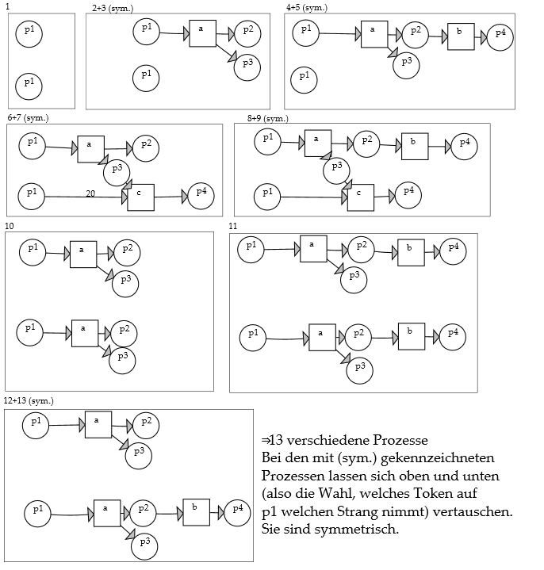

## Graph Tool

This WPF program can create and edit graph like structures (nodes and edges, including labels), for example structures from computer science like automata process graphs and petri nets.

It features an SVG export, so you can polish the result and include it in your assignments (that's what I did).

